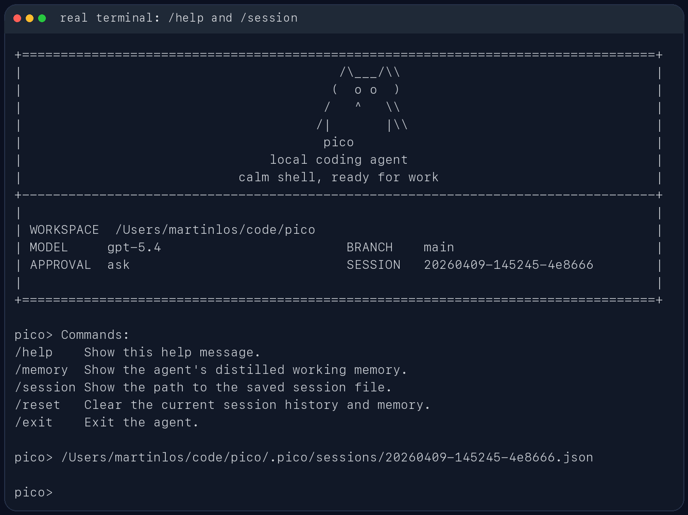

# Enigma

Enigma 是一个面向本地代码仓库的轻量级 coding agent。它运行在终端中，能够读取当前工作区、调用受约束的工具、执行一次性工程任务或进入交互式 REPL，并把会话、记忆和运行产物保存在本地。

这个项目的重点不是做一个聊天壳，而是实现一个可解释、可测试、可恢复的 agent runtime：从 CLI 参数解析、模型后端适配、上下文预算管理，到工具安全校验、会话持久化和跨会话记忆，都尽量保持清晰的模块边界。

## 项目亮点

- **多模型后端**：支持 Ollama、OpenAI 兼容 Responses API、Anthropic 兼容 Messages API。
- **仓库感知工作流**：启动时采集 Git 状态、项目文档、目录结构和最近提交，用于构建当前任务上下文。
- **受控工具执行**：对文件读写、shell 执行、搜索、委派等工具做路径校验、审批策略、重复调用检测和密钥脱敏。
- **分层记忆系统**：维护工作记忆、情景记忆、语义记忆，并通过文件 freshness 判断避免使用过期摘要。
- **上下文预算管理**：按模型上下文窗口动态设置 prompt budget，并在超限前压缩 history、工具结果和记忆片段。
- **Plan / Review / Skills**：内置 `/plan` 只读规划、`/review` 代码审查、`/skills` 技能加载等面向工程任务的命令。
- **可追踪运行产物**：每次任务生成 `task_state.json`、`trace.jsonl`、`report.json`，便于复盘和调试。
- **测试覆盖完整**：围绕 runtime、记忆、上下文管理、安全约束、技能系统、审查流程和 session DB 编写了单元测试。

## 使用截图

CLI 帮助信息：


启动界面：


REPL 内置命令与会话路径：



## 技术栈

- Python 3.10+
- 标准库优先的实现风格
- `setuptools` 构建与 console script 入口
- `pytest` 测试
- `ruff` 静态检查
- SQLite / FTS5 用于跨会话检索与摘要存储

## 项目结构

```text
enigma/
  cli.py              # CLI 参数解析、模型后端选择、REPL 启动
  runtime.py          # Agent 控制循环、工具调度、trace 与记忆更新
  models.py           # Ollama / OpenAI-compatible / Anthropic-compatible 客户端
  tools.py            # 文件、shell、搜索、委派等工具实现
  context_manager.py  # prompt 预算、压缩与上下文组装
  memory.py           # 分层记忆、文件摘要 freshness、语义记忆
  workspace.py        # Git 与工作区快照
  storage/            # SessionDB 与持久化存储
  skills/             # 内置技能模板
tests/                # pytest 测试套件
docs/                 # 架构说明与面试速查材料
assets/screenshots/   # README 截图素材
```

更完整的实现拆解见 [docs/agent-assembly.md](docs/agent-assembly.md)。

## 安装

需要 Python 3.10 或更高版本。

使用 `uv`：

```bash
uv sync
```

或使用普通 Python 环境：

```bash
pip install -e .
```

安装后会注册 `enigma` 命令，也可以通过模块方式启动：

```bash
python -m enigma
```

## 快速开始

在当前仓库中启动交互模式：

```bash
uv run enigma
```

指定工作目录：

```bash
uv run enigma --cwd /path/to/repo
```

执行一次性任务：

```bash
uv run enigma "inspect the test failures and propose a fix"
```

进入只读规划模式：

```bash
uv run enigma --plan "add tests for the memory module"
```

## 模型后端配置

### Ollama

```bash
ollama serve
ollama pull qwen3.5:4b
uv run enigma --provider ollama --model qwen3.5:4b
```

### OpenAI 兼容接口

```bash
export OPENAI_API_BASE="https://your-api.example/v1"
export OPENAI_API_KEY="your-api-key"
export OPENAI_MODEL="gpt-5.4"
uv run enigma --provider openai
```

### Anthropic 兼容接口

```bash
export ANTHROPIC_API_BASE="https://your-api.example/v1"
export ANTHROPIC_API_KEY="your-api-key"
export ANTHROPIC_MODEL="claude-sonnet-4-6"
uv run enigma --provider anthropic
```

`enigma` 会对常见密钥环境变量做脱敏处理，也可以通过 `--secret-env-name` 或 `ENIGMA_SECRET_ENV_NAMES` 追加需要保护的变量名。

## 常用命令

交互式 REPL 中支持：

- `/help`：查看内置命令
- `/plan <task>`：进入只读探索与计划审批流程
- `/review [target]`：审查当前变更、指定分支、PR 链接或文件
- `/skills`：列出可用技能
- `/compact [focus]`：压缩工作记忆、情景记忆、语义记忆和 history
- `/memory`：查看当前记忆摘要
- `/session`：查看当前 session 文件路径
- `/reset`：清空当前 session 状态
- `/exit` 或 `/quit`：退出 REPL

## 安全与持久化

Enigma 默认把高风险操作放在审批策略之下：

```bash
uv run enigma --approval ask
uv run enigma --approval auto
uv run enigma --approval never
```

本地运行状态会写入 `.enigma/`，包括：

- `.enigma/sessions/`：会话 JSON
- `.enigma/runs/<run_id>/task_state.json`
- `.enigma/runs/<run_id>/trace.jsonl`
- `.enigma/runs/<run_id>/report.json`

这些内容包含本地运行轨迹，已在 `.gitignore` 中排除，不会随仓库提交。

## 开发与测试

运行测试：

```bash
python -m pytest -q
```

运行静态检查：

```bash
python -m ruff check enigma tests
```

如果使用 `uv`，也可以写成：

```bash
uv run pytest -q
uv run ruff check enigma tests
```

## 设计取舍

Enigma 保持较少的外部依赖，核心逻辑尽量由标准库实现，便于阅读、调试和面试时讲清楚。项目目前更适合作为本地 agent runtime 与工程化能力展示，而不是面向普通用户的完整商业产品。

主要取舍包括：

- 优先保证工具执行可控和可追踪，而不是追求最大权限自动化。
- 使用结构化 trace 与 report 保存运行现场，方便复盘。
- 将模型协议、上下文管理、记忆系统和工作区操作拆成独立模块，降低单点复杂度。
- 测试覆盖安全边界和状态恢复等容易出错的路径。

## 当前状态

项目处于原型完善阶段，核心 CLI、runtime、记忆、上下文管理、审查命令和技能系统已经具备可运行实现。后续可以继续补充端到端示例、更多 provider 兼容性测试，以及更友好的安装发布流程。
